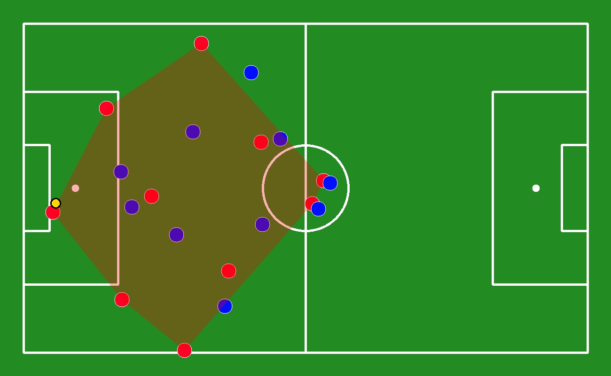

# 📹 Football Video Analysis Application

This Streamlit-based application provides two main functionalities for football video analysis:

1. **⚽ Action Analysis:** Upload football videos to generate timelines, visualizations, and analytical clips.
2. **📊 Tactical Visualization:** Upload videos to generate advanced tactical visualizations.

## 🚀 Features
- **Action Analysis:**
  - Generates interactive timelines and video clips.
  
- **Tactical Visualization:**
  - Generate detailed tactical insights from match footage.
  - Visualize player movements and team formations.

## 🛠️ Installation

1. Clone the repository:
   ```sh
   git clone https://github.com/RBFA_AI_Project.git
   cd RBFA_AI_Project
   ```
2. Install dependencies:
   ```sh
   pip install -r requirements.txt
   ```
3. Run the application:
   ```sh
   streamlit run app.py
   ```

## 📂 Project Structure
```
📁 your-repo/
│-- 📜 main.py             # Main Streamlit application
│-- 📜 interface1.py      # Action analysis module
│-- 📜 interface2.py      # Tactical visualization module
│-- 📜 requirements.txt   # Python dependencies
```

## 📝 Usage
- Open the web interface and navigate between the two tabs:
  - **Action Analysis:** Upload a football video to extract key moments.
  - **Tactical Visualization:** Upload a video for tactical insights.

## 🏆 Results & Examples

### 📸 Image Visualizations

#### 🔹 Tactical Views & Team Connections  
Visualization of player positions and their connections to analyze team structure.

#### 🔹 Tactical Views & Team Connections  
Visualization of player positions and their connections.

| Tactical Views | Team Connections |
|---------------|-----------------|
|  |  |

#### 🏟️ Convex Areas & Team Pitch Occupation  
Analysis of pitch control and space occupation.

| Convex Areas | Team Pitch Occupation |
|-------------|-----------------------|
|  |  |


#### ⏳ Timeline Generation  
Automatic timeline generation of key match events.

<p align="center">
  
</p>

---

### 🎥 Generated Videos  

#### 🔹 Tactical Insights Compilation  
A video showcasing multiple analytical visualizations:

- **Team Occupation (Areas)**  
- **Quantitative Team Occupation**  
- **Defense, Middle, or Attack Areas or Lines**  

<p align="center">
  
</p>

</p>

